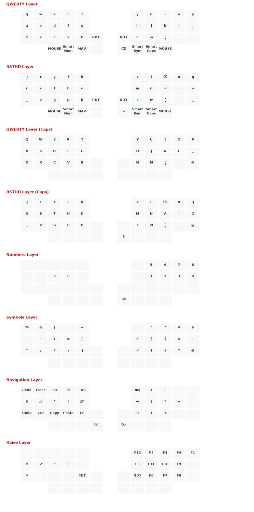

# Kyria

My keymap uses the following features:
- Custom layers & layer switching (Only 1 QMK layer, `user_layers.c`)
- Internally uses custom 8-bit keycodes
- Callum style Oneshot Modifiers (a rewrite, `oneshot.c`, `user_oneshot.c`)
  - plus a modification to allow double-tap to lock a modifier
- Smart Numbers (`feature.c`)
- Smart Caps (`feature.c`) (can handle up to 4 seperator symbols)
- Camel Case (leader c-c) (`user_leader.c`)
- SYM key can be tapped for a oneshot key from the SYM layer (`feature.c`)
- RAISE layer can be activated by holding NAV and SYM like tri-layer. (`feature.c`)
- RAISE layer can also be activated/locked by first tapping SYM then tapping NAV (`feature.c`)
- Custom 'leader' implementation using NAV as leader key (`leader.c`, `user_leader.c`)
- Custom normal/shift/ctrl/alt keycodes (`cushi.c`)
- Custom OS keycodes to deal with Mac OS / Windows / Ubuntu (`cukey.c`)
- VIM basic features (`vim.c`)

# Leader

The leader key is the same key that activates the NAVIGATION layer (hold), however we treat it as a leader when it is tapped.
When it is a single tap the user has 250 ms to tap the first letter in the chain, the letter following are not time bound.
Tapping the leader twice means that a second set of chains will be used, also entering the chain is not time bound. Then
there is also a third set of chains, also not time bound, that can be activated by tapping leader three times.

Examples:

single tap leader chains

- `leader f`, this will activate *easy motion* (vscode)
- `leader z`, this will center the cursor in the middle of the screen (vscode)
- `leader d d`, this will execute a *delete line* command
- `leader o o`, this will execute a *insert line below* command
- `leader g g`, this will put the cursor at the top of the document
- `leader c i w`, this will execute a *change inside word* command
- etc.. see `user_leader.c` for the full list

double tap leader chains

- `leader leader n`, this will print ` != `
- `leader leader a`, this will print ` && `
- `leader leader o`, this will print ` || `
- etc.. see `user_leader.c` for the full list

# Status

- HillSide: OK
- Kyria: OK
- Moonlander: OK

# Setup

- Clone the QMK repository and install/setup
- Symlink, see `symlink-howto.md`

Then compile Kyria, Hillside or Moonlander:

- `make splitkb/kyria/rev1:jaykay`
- `make handwired/hillside/0_1:jaykay`
- `make moonlander:jaykay`

# Keymap

(Generated with `https://github.com/jurgen-kluft/go-qmk-keymap`)

