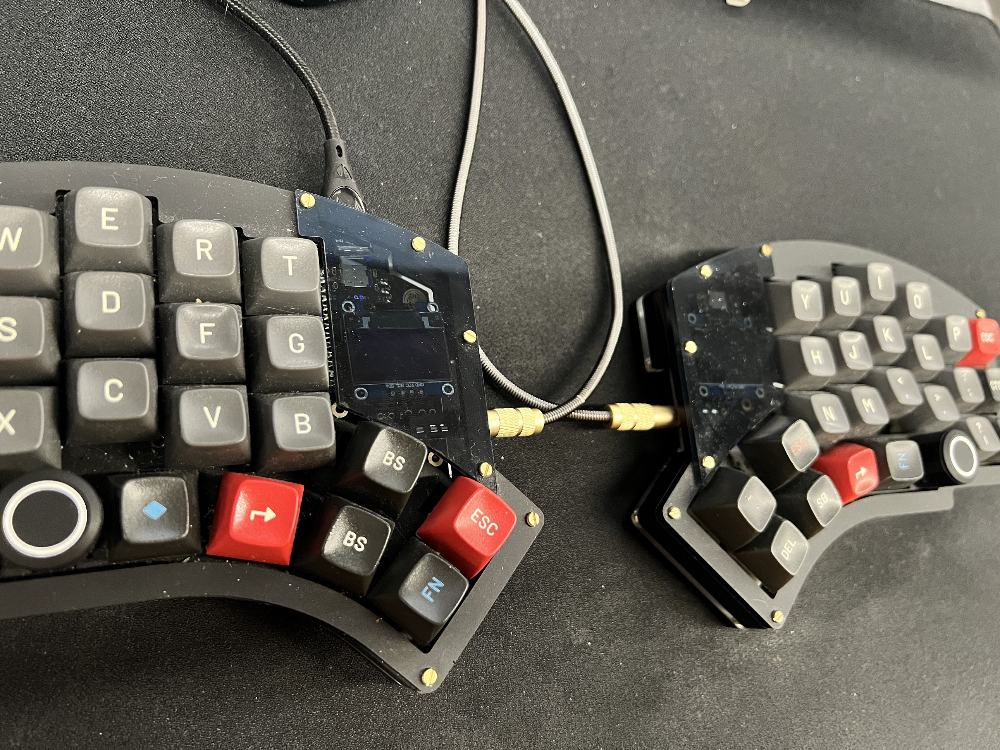

# Kyria

My keymap uses the following features:
- Callum style Oneshot Modifiers (a rewrite)
  - plus a modification to allow double-tap to lock a modifier
- Smart numbers 
- Smart caps words
- Custom normal/shift keycodes (cushi)
- Custom OS keycodes to deal with Mac OS / Windows / Ubuntu (cukey)

I have 3 Kyria keyboards, two at home and one at work (since April 2021).

The Kyria's I use daily have Gazzew Boba U4 switches.

Work 
Home 
First 

The Kyria is a DYI kit and will require soldering, although it is very doable and has an excellent online build guide. It and all of its parts can be purchased here: https://splitkb.com/

# Moonlander

My first split keyboard was the Moonlander.

Moonlander can be purchased here: https://www.zsa.io/moonlander/

# Keymap

