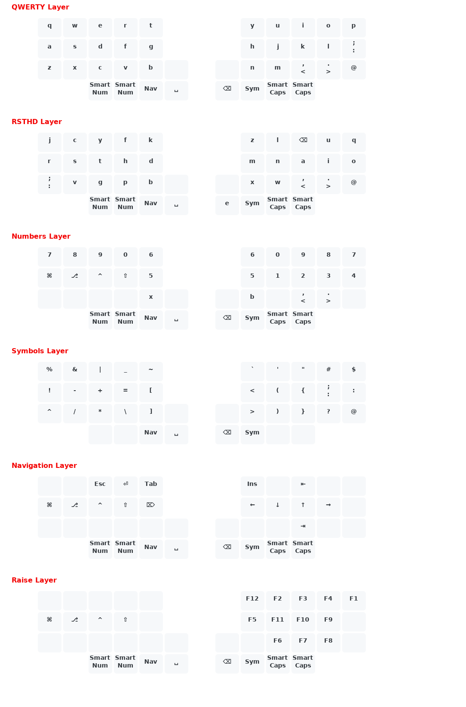

# Kyria

My keymap uses the following features:
- Callum style Oneshot Modifiers (a rewrite, `oneshot.c`)
  - plus a modification to allow double-tap to lock a modifier
- Smart numbers (`feature.c`)
- Smart caps words (`feature.c`) (can handle up to 4 seperator symbols)
- SYM key can be tapped for a oneshot key from the SYM layer (`feature.c`)
- RAISE layer can be activated by holding NAV and SYM like tri-layer.
  It can also be activated/locked by first tapping SYM then tapping NAV.
- Custom 'leader' implementation using NAV as leader key (`leader.c`)
- Custom normal/shift/ctrl/alt keycodes (`cushi.c`)
- Custom OS keycodes to deal with Mac OS / Windows / Ubuntu (`cukey.c`)
  TODO: needs a trim/clean

# Setup

- Clone the QMK repository and install/setup
- Symlink, see `symlink-howto.md`

Then compile Kyria or Hillside:

- `qmk compile -kb splitkb/kyria/rev1 -km jaykay`
- `qmk compile -kb handwired/hillside/0_1 -km jaykay`

# Keymap

(Generated with `https://github.com/jurgen-kluft/go-qmk-keymap`)

